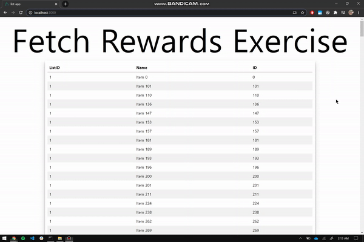

# Fetch-Rewards-Exercise
A VueJS with NuxtJS Single page application. 


## Build Setup
```bash
# clone repo
$ git clone https://github.com/MathewLister/Fetch-Rewards-Exercise.git

# install dependencies
$ sudo npm install --save

# serve with hot reload at localhost:3000
$ npm run dev
```

For detailed explanation on how things work, check out [Nuxt.js docs](https://nuxtjs.org).

## Assignment
Please write a web app that retrieves the data from https://fetch-hiring.s3.amazonaws.com/hiring.json.
Display this list of items to the user based on the following requirements:
- Display all the items grouped by "listId"
- Sort the results first by "listId" then by "name" when displaying.
- Filter out any items where "name" is blank or null.
- The final result should be displayed to the user in an easy-to-read list.
